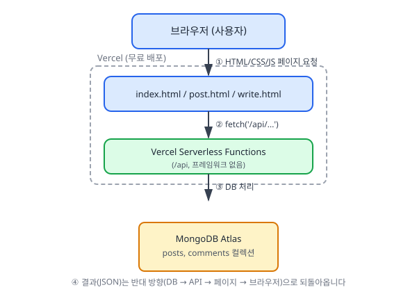
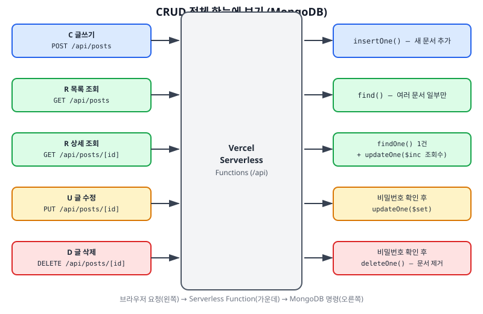
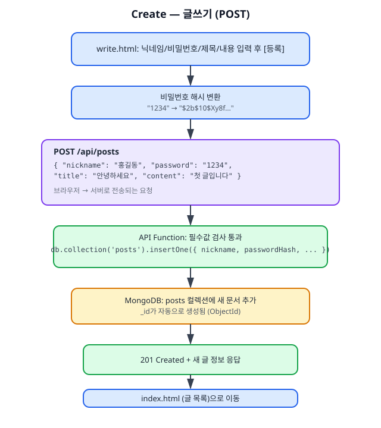
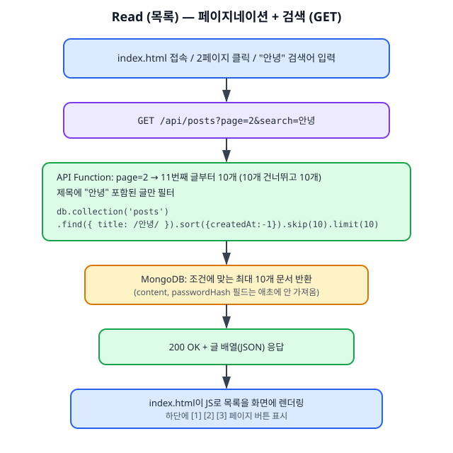
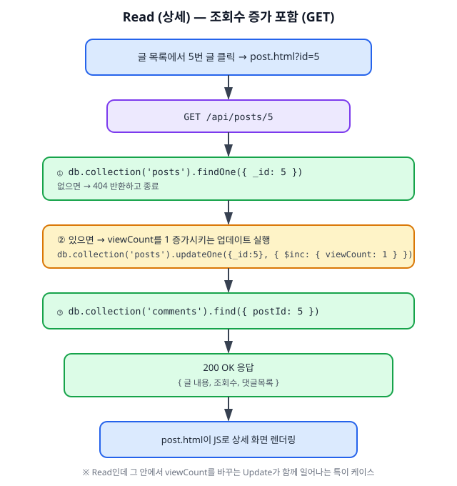
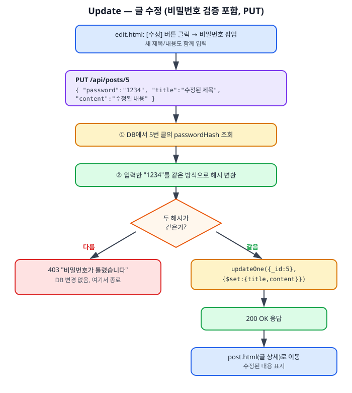
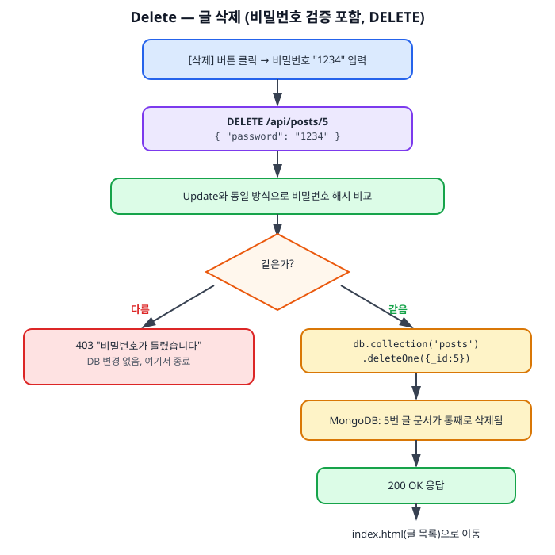
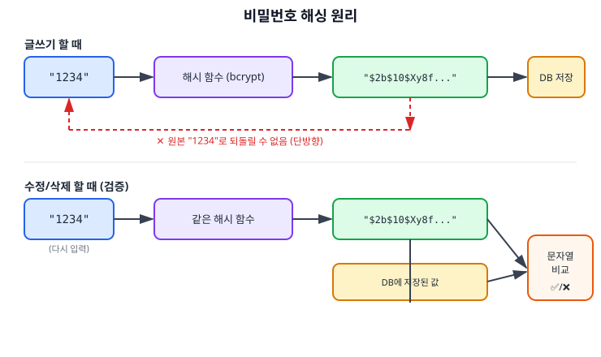
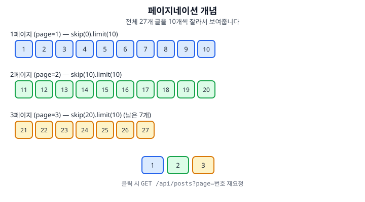

# 게시판 프로젝트 - 개념 학습 노트

설계/구현하면서 등장하는 핵심 개념을 정리합니다. 지금 학습 목표는 **CRUD 흐름
이해**이므로, CRUD 파트를 가장 자세하게 다룹니다. (계속 업데이트됩니다)

> 스택 변경 안내: 처음엔 Next.js + Supabase로 설계했었는데, "프레임워크 없이
> HTML/CSS/JS 기초만, DB/SQL 경험 없음"이라는 학습자 상황에 맞춰
> **순수 HTML/CSS/JS + Vercel Serverless Functions + MongoDB Atlas + Vercel Blob**
> 로 전면 변경했습니다. 아래 내용은 모두 최신 스택 기준입니다.

---

## 1. 서버리스 함수 (Serverless Functions)

전통적인 서버(Node.js/Express 등)는 컴퓨터 한 대를 계속 켜놓고 요청을 기다립니다.
**서버리스**는 반대로, 평소엔 아무것도 켜져 있지 않다가 **요청이 올 때만** 코드가
잠깐 실행되고 끝나는 방식입니다.

- Vercel에 배포하면, `api/posts.js` 같은 파일 하나하나가 "요청이 오면 실행되는
  작은 함수"가 됩니다. **Next.js 같은 프레임워크가 없어도** Vercel 자체 기능으로
  동작합니다 — `/api` 폴더 규칙만 지키면 됩니다.
- 함수가 끝나면 메모리에 아무것도 안 남기 때문에, 데이터를 저장하려면
  반드시 **외부 데이터베이스**(MongoDB Atlas)가 필요합니다.

## 2. 순수 HTML 다중 페이지 구조

프레임워크 없이 화면마다 별도의 `.html` 파일을 둡니다.

- `index.html` — 글 목록
- `post.html` — 글 상세 (`post.html?id=5`처럼 **쿼리스트링**으로 어떤 글인지 표시)
- `write.html` — 글쓰기
- `edit.html` — 글 수정

화면 이동은 리액트 라우터 같은 것 없이, 그냥 `<a href="post.html?id=5">`나
자바스크립트의 `location.href = "post.html?id=5"`로 처리합니다. 각 페이지의
`<script>`에서 `new URLSearchParams(location.search).get('id')`로 주소의
`id` 값을 읽어옵니다.

## 3. Vercel Serverless Functions (프레임워크 없이)

- Next.js 없이도 Vercel은 프로젝트 루트의 `/api` 폴더를 보고 자동으로
  API 엔드포인트를 만들어 줍니다.
- `api/posts.js` → `/api/posts` 라는 백엔드 API 주소가 됨
- `api/posts/[id].js` → `/api/posts/5`, `/api/posts/9`처럼 동적 주소도 지원
  (대괄호 `[id]` 파일명 규칙은 Vercel 자체 기능이라 Next.js가 없어도 동작합니다)
- 각 함수 파일은 `req`(요청)와 `res`(응답) 객체를 받아 `req.method`로
  GET/POST/PUT/DELETE를 구분해서 처리합니다.

## 4. MongoDB Atlas (SQL이 필요 없는 DB)

- 무료로 쓸 수 있는 클라우드 데이터베이스
- SQL 문법 없이, **자바스크립트 객체와 거의 똑같이 생긴 "문서(document)"** 를
  다룹니다. 예: `db.collection('posts').insertOne({ title: "안녕", ... })`
- SQL의 "테이블" = MongoDB의 "컬렉션", SQL의 "행(row)" = MongoDB의 "문서(document)"
- 자동 생성되는 고유 번호는 `_id`라는 이름의 값(ObjectId)입니다.

## 5. Vercel Blob (이미지 저장소)

MongoDB는 텍스트 데이터를 다루기엔 좋지만 이미지 같은 파일을 넣기엔 적합하지
않습니다. 그래서 이미지 파일은 **Vercel Blob**이라는 별도 저장소에 올리고,
MongoDB에는 그 파일의 **주소(URL)만** 저장합니다 (자세한 흐름은 5.1 참고).

## 6. 전체 아키텍처 (그림)



브라우저 → HTML/CSS/JS 페이지 → Serverless Functions → MongoDB/Vercel Blob
순서로 요청이 흐르고, 결과는 반대 방향으로 되돌아옵니다. 페이지와 API 함수는
둘 다 Vercel 위에서 무료로 함께 호스팅됩니다.

---

# 7. CRUD 흐름 완전 정리 (핵심 학습 파트)

## 7.0 CRUD란?

게시판을 포함한 대부분의 앱은 결국 데이터를 두고 4가지 일만 합니다.

| 글자 | 의미 | 우리 게시판에서의 예 | HTTP 메서드 | 주소 |
|------|------|----------------------|-------------|-----------|
| **C**reate | 새로 만들기 | 글쓰기, 댓글쓰기 | POST | `/api/posts` |
| **R**ead | 조회하기 | 글 목록 보기, 글 하나 상세 보기 | GET | `/api/posts`, `/api/posts/[id]` |
| **U**pdate | 수정하기 | 글 수정 | PUT | `/api/posts/[id]` |
| **D**elete | 삭제하기 | 글 삭제 | DELETE | `/api/posts/[id]` |

"HTTP 메서드"란 브라우저가 서버에게 "나 이번엔 뭘 하고 싶어"를 알려주는 표시입니다.
같은 주소라도 메서드가 다르면 서버는 완전히 다른 동작을 합니다.

```
같은 주소, 다른 메서드 = 다른 동작
GET    /api/posts/5   → 5번 글을 "조회"
PUT    /api/posts/5   → 5번 글을 "수정"
DELETE /api/posts/5   → 5번 글을 "삭제"
```

전체를 한 장으로 보면 이렇습니다.



---

## 7.1 Create — 글쓰기



**핵심 포인트**: Create는 "새 문서(document)를 DB에 추가"하는 것입니다.
1. 이미지가 있으면 먼저 Vercel Blob에 업로드해서 URL을 받습니다 (없으면 생략).
2. 비밀번호를 그대로 보내지 않고 해시로 변환합니다.
3. `POST /api/posts`로 닉네임/비밀번호해시/제목/내용/이미지URL을 전송합니다.
4. API 함수가 필수값을 검사하고 `insertOne()`으로 DB에 새 문서를 추가합니다.
5. 성공하면 새로 생긴 글 정보와 함께 201 응답, 페이지는 목록으로 이동합니다.

---

## 7.2 Read — 조회하기 (목록 / 상세, 2가지가 있음)

### 7.2-A 목록 조회 (페이지네이션 + 검색 포함)



**포인트**: 목록 조회는 절대 `content`(본문) 전체나 `passwordHash`를 함께
가져오지 않습니다. 필요한 필드만 골라 가져오는 게 실무 기본입니다 — 안 그러면
느려지고, 비밀번호 해시가 브라우저로 새어나가는 보안 문제도 생깁니다.

### 7.2-B 상세 조회 (조회수 증가 포함)



**포인트**: 상세 조회 안에 "조회"(Read)와 "수정"(Update, 조회수+1)이 같이
숨어 있습니다. Read 요청이 부수적으로 다른 데이터를 변경시키는, 실제 서비스에서
흔히 볼 수 있는 패턴입니다.

---

## 7.3 Update — 글 수정 (비밀번호 검증 포함)



**포인트**: Update는 항상 "먼저 권한(비밀번호) 확인 → 통과해야 실제 변경"
순서입니다. 틀리면 DB는 건드리지 않고 그대로 종료합니다. 이 "확인 후 실행"
패턴은 Delete에서도 똑같이 반복됩니다.

---

## 7.4 Delete — 글 삭제 (비밀번호 검증 포함)



**포인트**: Delete는 되돌릴 수 없는 작업입니다. 실무에서는 삭제 전 "정말
삭제할까요?" 확인창을 한 번 더 띄우는 경우가 많은데, 우리 프로젝트에서는
비밀번호 입력 자체가 그 확인 역할을 겸합니다.

---

## 7.5 정리

이 4가지 동작(insertOne / find / updateOne / deleteOne)이 이 프로젝트의
뼈대입니다. 앞으로 구현 단계에서 나오는 모든 코드는 결국 이 중 하나를 API
함수 안에서 처리하는 것뿐입니다.

---

## 8. 비밀번호 해싱 보충 개념



비밀번호는 저장할 때부터 "원래 문자로 되돌릴 수 없는" 방식(해시)으로 바뀌어서
저장됩니다. 나중에 맞는지 확인할 때도 저장된 값을 복호화하는 게 아니라
**입력값을 같은 방식으로 다시 해시해서 문자열이 같은지 비교**합니다
(7.3, 7.4에서 실제 사용 예시 참고).

## 9. 페이지네이션 개념



화면 하단 `[1] [2] [3]` 버튼 클릭 → `GET /api/posts?page=번호` 재요청 (7.2-A 참고)

---

*설계가 진행되면서 계속 추가됩니다.*
